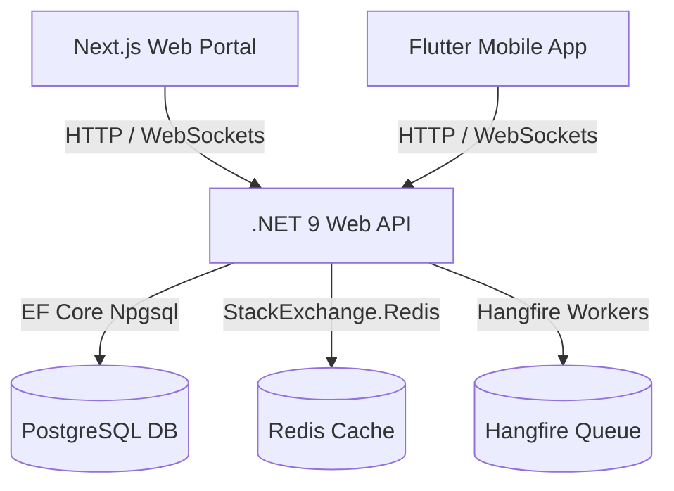

# PatientCare: Enterprise Patient & Clinic Management System

PatientCare is a comprehensive, production-grade, multi-client healthcare platform designed to automate clinical operations, optimize patient scheduling, secure electronic health records (EHR), and manage real-time patient-doctor communications.

The repository is organized as a monorepo consisting of:
1. **ASP.NET Core 9.0 Web API** (`/backend`): High-throughput REST API with Hangfire scheduling, Redis caching, and Npgsql EF Core.
2. **Next.js Web Portal** (`/web`): Sleek modern dashboard using TailwindCSS and React Redux.
3. **Flutter Mobile App** (`/mobile`): Fluid cross-platform app compiled for Android and iOS using Riverpod.

---

## 📱 Mobile APK Download
Get the pre-compiled Android release binary directly:
👉 **[Download Release APK (Direct Raw link)](https://github.com/bilash-biswas/patient-care-system/raw/main/mobile/build/app/outputs/flutter-apk/app-release.apk)** or browse the file **[here](./mobile/build/app/outputs/flutter-apk/app-release.apk)**.

---

## 🏗️ Architecture Overview



---

## 🌟 Feature Breakdown by Component

### 1. 🖥️ Backend API (`/backend`)
* **Real-time Synchronization Engine**:
  - `ChatHub`: Manages client connection states and delivers instant message payloads containing resolved sender names.
  - `NotificationHub`: Pushes real-time alerts (e.g., payment confirmations, chat notifications) globally.
* **Background Task Scheduler**:
  - Utilizes **Hangfire** with Postgres job persistence.
  - Registers recurring reminders running daily at 8:00 AM UTC to query upcoming appointments and dispatch notification alerts.
* **Caching & Performance Optimization**:
  - Leverages **Redis Distributed Caching** to serve instant dashboard metrics (active users, transaction volumes, doctor count).
  - Explicit composite indexes on database entities (`AppointmentDate`, `SenderId`, `ReceiverId`, `SentAt`, and `Token`) to prevent queries from scaling poorly.
* **API Security & Resiliency**:
  - JWT Authentication using dual-token structures (Access Token and Refresh Token).
  - Custom `ExceptionMiddleware` intercepts execution errors globally and sanitizes raw stack traces in production.
  - Rate limiting middleware employing fixed-window limits for requests and token-bucket algorithms for auth routes.
  - Secure `/hangfire` route restricted via a custom dashboard authorization filter (`HangfireAdminAuthorizationFilter`).

### 2. 🌐 Next.js Web Portal (`/web`)
* **Interactive Dashboard Analytics**:
  - Admins view dynamic charts showing revenues, patient registrations, operational counts, and invoice feeds.
* **Unified Appointment Manager**:
  - Filter schedules by status (`All`, `Scheduled`, `Completed`, `Cancelled`, `NoShow`).
  - Perform instant inline status updates (medical staff can cancel, complete, or log no-shows directly).
* **Dynamic Doctor Profile & Booking Page**:
  - Custom route matching `/doctors/[id]` to render individual physician details.
  - Interactive **two-column layout**: left column showcases doctor details and experience tags; right column displays horizontal date carousels and available AM/PM slot buttons.
* **Stripe Payment Gateway**:
  - Uses Stripe Elements to securely accept credit card payments.
  - Restricts bookings by enforcing a `PendingPayment` status that auto-directs patients to the billing area before scheduling confirmation.
* **EHR & Medical Records Register**:
  - Detailed lists showing symptoms, diagnoses, treatment plans, and matching physician signatures.

### 3. 📱 Flutter Mobile App (`/mobile`)
* **2-Step Booking Wizard**:
  - Modern wizard dialog separating scheduling steps:
    - **Step 1**: Select Date and Choice-Chips slot ranges.
    - **Step 2**: Provide reason, select patient, and enter symptoms.
  - Integrates a visual progress indicator to guide the user.
* **Hardware-Backed Credentials Security**:
  - Automatically encrypts user authentication tokens in Android KeyStore and iOS KeyChain using `FlutterSecureStorage`.
* **Inline Card Checkout Simulator**:
  - Real-time credit card visualizer reflecting user entries (card number, CVV, expiry, name) dynamically as they type.
  - Communicates directly with the billing API to verify and settle pending invoices.
* **Background Socket Connection**:
  - Connects SignalR hubs globally on app startup.
  - Bypasses lazy-loading limits to guarantee background notifications and toast popups arrive even when outside the active chat thread.
* **Notification History Center**:
  - Access a dedicated notification list tab directly from the user profile screen.
  - Supports marking alerts as read, swiping to delete individual alerts, and clearing the entire feed.

---

## 🛠️ Complete Feature Matrix

| Feature | Backend Support | Next.js Web | Flutter Mobile |
| :--- | :---: | :---: | :---: |
| **Real-time Chat & Hub** | ✅ | ✅ | ✅ |
| **Push Notification Toasts** | ✅ | ✅ | ✅ |
| **Notification Center** | ✅ | ❌ | ✅ |
| **2-Step Booking Wizard** | ✅ | ❌ | ✅ |
| **Stripe Payment Checkout** | ✅ | ✅ | ✅ (Simulated) |
| **Hangfire Reminders** | ✅ | ✅ (Dashboard) | ❌ |
| **Distributed Caching** | ✅ (Redis) | ✅ (Dashboard Stats) | ❌ |
| **Medical Records (EHR)** | ✅ | ✅ | ✅ |
| **Hardware-Encrypted Auth** | ❌ | ✅ (Cookie-safe) | ✅ (`SecureStorage`) |
| **Prescription Refills** | ✅ | ✅ | ✅ |

---

## 🚀 Installation & Local Launch

### Option A: Complete Docker Deployment (All Services)
Launch all components (Npgsql Database, Redis cache, pgAdmin, Backend Web API, and Next.js Web Portal) in one containerized network:
```bash
docker compose up -d --build
```
* **Next.js Portal**: `http://localhost:3000`
* **API Swagger Docs**: `http://localhost:5278`
* **Hangfire Dashboard**: `http://localhost:5278/hangfire`

---

### Option B: Step-by-Step Developer Launch

#### 1. Setup Backend Dependencies
Start Database and Redis cache containers:
```bash
docker compose up -d postgres redis
```

#### 2. Start ASP.NET Core API
```bash
cd backend
dotnet run
```

#### 3. Start Next.js Web Portal
```bash
cd web
npm install
npm run dev
```

#### 4. Run Flutter Mobile App
Ensure you have an active virtual emulator or connected physical testing device:
```bash
cd mobile
flutter pub get
flutter run
```
